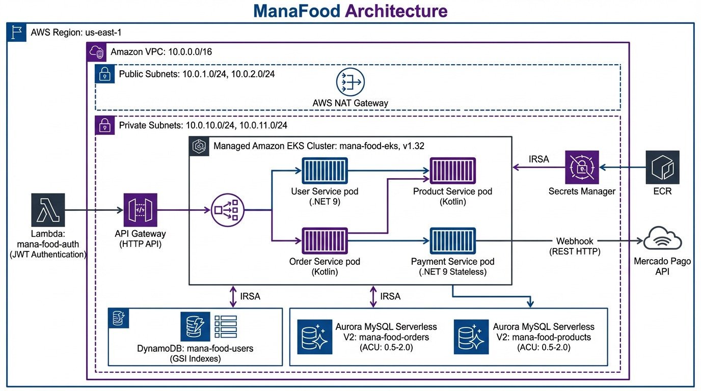

# Mana Food Infra

Infraestrutura como código (Terraform) da plataforma Mana Food: VPC, EKS, Aurora MySQL (Serverless v2), Lambda, API Gateway, IAM, KMS, CloudWatch e manifests Kubernetes.

## Diagrama do fluxo de Infraestrutura


## 🏗️ Arquitetura

```
mana-food-infra/
├── .github/workflows/
│   └── cd-deploy.yml                # Pipeline de deploy (GitHub Actions)
└── infra/
    ├── k8s/                          # Manifests Kubernetes
    │   ├── api-configmap.yaml
    │   ├── api-deployment.yaml
    │   ├── api-hpa.yaml
    │   ├── api-secret.yaml
    │   └── api-service.yaml
    └── terraform/
        └── envs/
            └── prod/                 # Infra principal (ambiente prod)
                ├── backend.tf        # Backend S3 (remote state)
                ├── provider.tf       # Providers (aws, kubernetes, helm)
                ├── variables.tf      # Variáveis (ex.: project_name, bucket_state_name)
                ├── main.tf           # Orquestra a stack (VPC, EKS, Aurora, Lambda)
                ├── vpc.tf            # VPC, subnets, rotas, NAT/IGW
                ├── eks.tf            # EKS (cluster, node group)
                ├── aurora.tf         # Aurora MySQL Serverless v2 + SG/SubnetGroup
                ├── lambda.tf         # IAM, SG, Log Group, Lambda .NET, API Gateway
                └── outputs.tf        # Saídas (endpoints, nomes, ARNs)
```

## 🚀 Funcionalidades

- ✅ VPC privada com subnets públicas/privadas, NAT/IGW e rotas
- ✅ EKS (cluster + node group gerenciado) com KMS e CloudWatch Logs
- ✅ Aurora MySQL Serverless v2 com Subnet Group e SG dedicados
- ✅ Lambda .NET (provided.al2023) com VPC access, SG, CloudWatch Logs e API Gateway
- ✅ Manifests Kubernetes (Deployment, Service, HPA, ConfigMap, Secret)
- ✅ Tags e naming padronizados por ambiente/projeto

## 📋 Pré-requisitos

- Terraform ≥ 1.4
- AWS CLI configurado (perfil com permissões)
- kubectl e (opcional) Helm
- Bucket S3 para o state remoto (defina via TF_VAR_bucket_state_name)

```bash
# Configurar credenciais e região
aws configure
export AWS_REGION=us-east-1

# Variáveis Terraform (ex.: backend/state)
export TF_VAR_bucket_state_name="seu-bucket-tfstate"
```

## ⚙️ Execução (Terraform)

Fluxo recomendado (primeiro EKS, depois o restante):

```bash
# Inicialização (no root usando -chdir)
terraform -chdir=infra/terraform/envs/prod init -input=false

# 1) Criar/alinhar o EKS (ou importe, ver seção Importar)
terraform -chdir=infra/terraform/envs/prod plan -target=module.eks -out=eks.plan -input=false
terraform -chdir=infra/terraform/envs/prod apply -input=false eks.plan

# 2) Criar o restante da stack
terraform -chdir=infra/terraform/envs/prod plan -out=tfplan -input=false
terraform -chdir=infra/terraform/envs/prod apply -input=false tfplan
```

Dicas:
- Gere e aplique o plano na mesma etapa (CI) ou salve o tfplan como artifact entre jobs.
- Se recursos já existem na AWS, importe-os ao state (evita erros AlreadyExists).

## ☸️ Deploy Kubernetes (após EKS pronto)

```bash
# Apontar o kubeconfig para o cluster
aws eks update-kubeconfig --name mana-food-eks --region ${AWS_REGION}

# Aplicar manifests
kubectl apply -f infra/k8s/api-configmap.yaml
kubectl apply -f infra/k8s/api-secret.yaml
kubectl apply -f infra/k8s/api-deployment.yaml
kubectl apply -f infra/k8s/api-service.yaml
kubectl apply -f infra/k8s/api-hpa.yaml

# Verificar
kubectl get pods,svc,hpa -n default
```

## 🔁 Importar recursos existentes (exemplos)

```bash
# EKS
terraform -chdir=infra/terraform/envs/prod import 'module.eks.aws_eks_cluster.this[0]' mana-food-eks
terraform -chdir=infra/terraform/envs/prod import 'module.eks.module.kms.aws_kms_alias.this["cluster"]' arn:aws:kms:us-east-1:<ACCOUNT_ID>:alias/eks/mana-food-eks
terraform -chdir=infra/terraform/envs/prod import 'module.eks.aws_cloudwatch_log_group.this[0]' '/aws/eks/mana-food-eks/cluster'

# Aurora
terraform -chdir=infra/terraform/envs/prod import 'module.aurora.aws_rds_cluster.this[0]' mana-food-aurora-2
terraform -chdir=infra/terraform/envs/prod import 'module.aurora.aws_rds_cluster_instance.this["main"]' mana-food-aurora-2-main
terraform -chdir=infra/terraform/envs/prod import 'aws_db_subnet_group.aurora' mana-food-aurora-2

# Lambda / Logs / IAM
terraform -chdir=infra/terraform/envs/prod import 'aws_iam_role.lambda_role' mana-food-lambda-role
terraform -chdir=infra/terraform/envs/prod import 'aws_cloudwatch_log_group.lambda_logs' '/aws/lambda/mana-food-api'
terraform -chdir=infra/terraform/envs/prod import 'aws_lambda_function.api' mana-food-api || true

# Security Groups (exemplos)
terraform -chdir=infra/terraform/envs/prod import 'aws_security_group.lambda' sg-0b4f4e092e7fc198c
terraform -chdir=infra/terraform/envs/prod import 'aws_security_group.lambda_sg_vpc05b99' sg-0b84956290f6a245b
terraform -chdir=infra/terraform/envs/prod import 'module.aurora.aws_security_group.this[0]' sg-0bcc9be27248a3aef
terraform -chdir=infra/terraform/envs/prod import 'aws_security_group.aurora' sg-06bd02d584716cb67
```

## 🧰 Troubleshooting

- ResourceAlreadyExists (EKS, IAM Role, Log Group, DBSubnetGroup): importe o recurso ao state.
- DependencyViolation ao deletar SG: identifique ENIs/attachments que usam o SG
  ```bash
  aws ec2 describe-network-interfaces --filters Name=group-id,Values=<sg-id> --region ${AWS_REGION}
  ```
- Provider kubernetes “default cluster has no server defined”: aplique EKS primeiro, depois recursos k8s/helm.
- S3 data source “empty result”: defina corretamente TF_VAR_bucket_state_name.
- Aurora engine_version inválida: remova o pin fixo ou consulte versões válidas:
  `aws rds describe-db-engine-versions --engine aurora-mysql --region ${AWS_REGION}`

## 🔐 Boas práticas

- Use IAM de menor privilégio para Terraform
- Não commitar segredos nem tfvars com senhas
- Ative criptografia (KMS) sempre que possível
- Mantenha SGs e subnets da Lambda na mesma VPC

## 📎 Links úteis

- Terraform AWS Provider: https://registry.terraform.io/providers/hashicorp/aws/latest
- EKS Terraform Module: https://github.com/terraform-aws-modules/terraform-aws-eks
- Aurora MySQL: https://docs.aws.amazon.com/AmazonRDS/latest/AuroraUserGuide/
- Lambda + VPC: https://docs.aws.amazon.com/lambda/latest/dg/configuration-vpc.html
